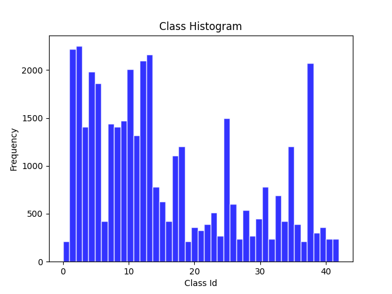
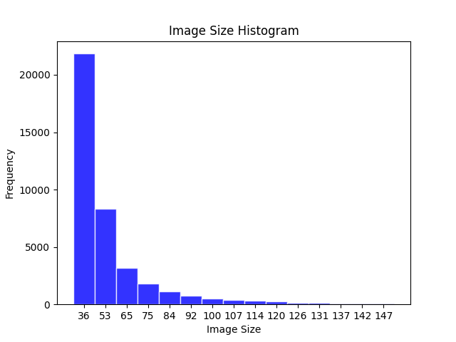
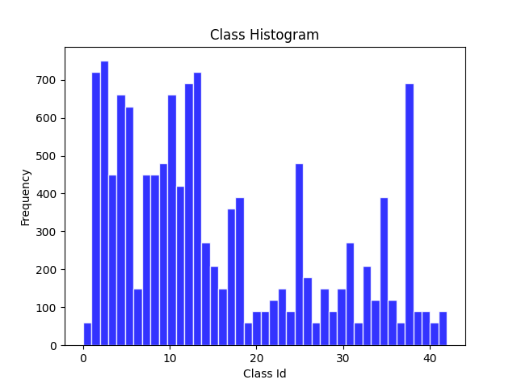
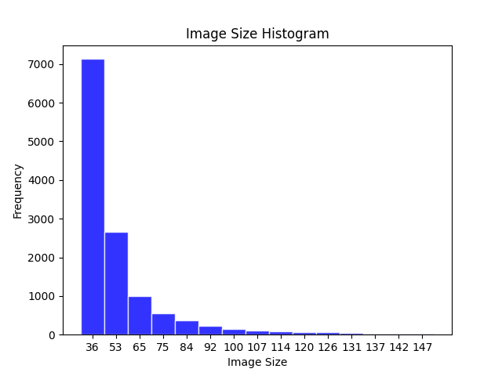
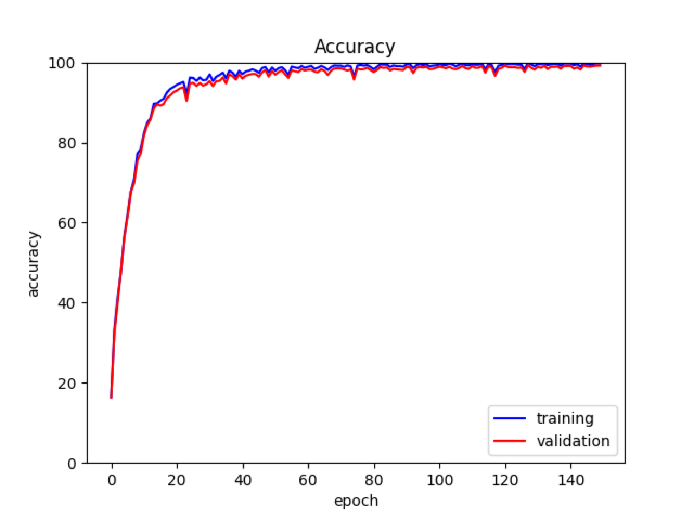
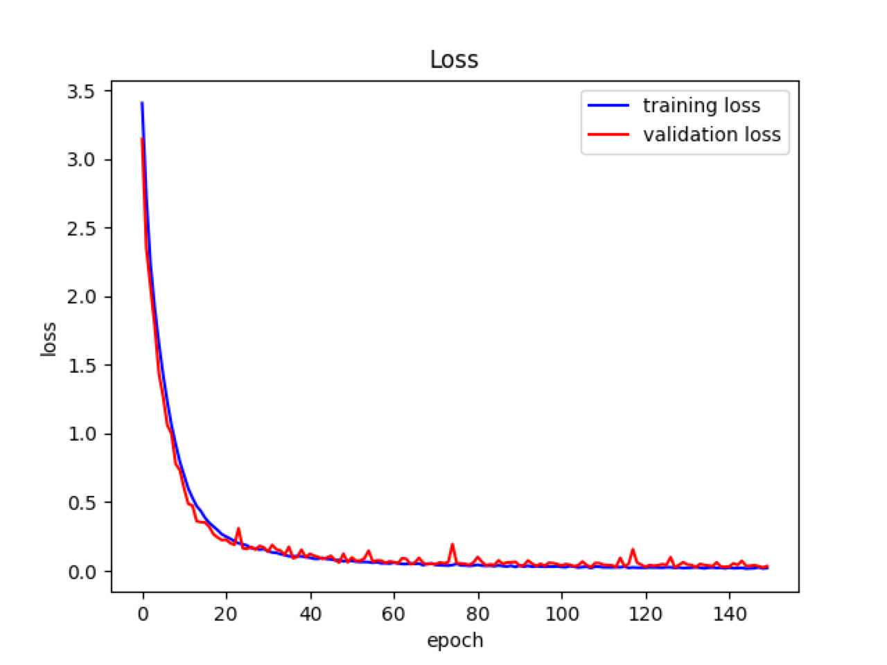

# traffic-signs
Python implementation of a deep learning based traffic sign classification module

# Requirements
- Python 3.9
- PyTorch 2.1

# Setup 
Install virtual environment for Python:
```
python -m venv venv
```

Activate virtual environment:
```
source venv/bin/activate
```
It is best to download PyTorch from the official site if any hardware acceleration wants to be used:

e.g.
Check [PyTorch](https://pytorch.org/get-started/locally/ "Start Locally | PyTorch") website and download it via pip:

```
pip install torch torchvision torchaudio --extra-index-url https://download.pytorch.org/whl/cu113
```

Install all remaining dependencies:
```
pip install -r requirements.txt
```
## VSCode Settings
VSCode settings that I have been using while developing the project is as:
```
{
    "[python]": {
      "editor.formatOnSave": true,
      "editor.defaultFormatter": "charliermarsh.ruff"
    },
    "python.analysis.typeCheckingMode": "off"
  }
```


# Dataset
I used German Traffic Sign Recognition Benchmark ([GTSRB](https://benchmark.ini.rub.de/gtsrb_dataset.html#Downloads)) as training, validation and test datasets. Images inside the dataset have arbitrary image dimensions which makes the training process a little bit difficult to work with. 

## Training
 Training dataset consists of 39,209 samples and 43 classes. Some information related with class frequency and image size (normalized to square) can be found in histograms below:
<p float="left">
  
  
</p>

## Test 
 Test dataset consists of 12,630 samples and 43 classes. Some information related with class frequency and image size (normalized to square) can be found in histograms below:
<p float="left">
  
  
</p>


# Training 
You can start training process by running `python classification.py` which will invoke training function inside Classification class. Training configurations can be found in `config.toml` file. Currently, training does not support hyperparameter tuning and any learning rate decay method. 

 I have implemented two baseline methods which can be located in nn package. 
- MNIST: Baseline MNIST model 1.2M parameters
- ResNet-18: Slightly downgraded to 2.8M parameters

Both of these models have adaptive pooling mechanisms, similar to SPP-Net, in order to process arbitrary sized images. 

## Batch Processing
Since images have arbitrary sized dimensions, in order to use batch processing, we would need some type of mechanism to stack tensors to a single dimension. For this case, I have used zero value paddings located around the image if the base image is positioned at the center for that particular batch. 

## Results

Model performance results can be found below for ResNet18 version. This version is trained on only images lower than 120x120 dimensions. All tests were conducted using batch size of 32. If we were to use batch size of 1, model experiences some performance loss on the test dataset. This can indicate that the batch padding mechanism greatly influences the model classification performance. 

|                     |   Accuracy  |   Recall  |   Precision  |   F1 Score  |
|:--------------------|------------:|----------:|-------------:|------------:|
|   Training          |   99.84%    |   99.81%  |   99.81%     |   99.81%    |
|   Validation        |   99.31%    |   99.23%  |   99.30%     |   99.26%    |
|   Test              |   88.98%    |   86.36%  |   85.34%     |   85.17%    |
|   Test - (Batch 1)  |   64.20%    |   60.13%  |   80.35%     |   66.57%    |

Accuracy and loss graphs for this model during training can be found below:

<p float="left">
  
  
</p>


# Deployment
I have not extracted the models by any means but they can be used by utilizing `Model` class in `model.py`. 

## Inference Time & Quantization
Tests were conducted on Intel® Core™ i7-4770K CPU and Nvidia RTX 2060S GPU. According to the tests, I couldn't fully utilize FP16 and INT8 cases for my ResNet-18 model. Model performance also was not affected by using any quantization. For MNIST model, FP16 only gives performance boost after 128 batch case. INT8 quantization gives like x4 more performance for 128 batch case. 

\
Inference Time Per Batch (ms)
|   Batch size  |   1      |   4       |   16      |   32      |   64       |   128      |
|:--------------|---------:|----------:|----------:|----------:|-----------:|-----------:|
|   FP32        |   2.378  |   4.167   |   6.709   |   8.162   |   10.521   |   11.910   |
|   FP16        |   4.675  |   11.573  |   18.331  |   21.693  |   30.698   |   35.433   |
|   FP32-CPU     |   3.532  |   10.540  |   31.778  |   66.825  |   143.325  |   327.065  |
|   INT8        |   3.741  |   11.041  |   37.596  |   72.519  |   143.976  |   329.411  |

\
Inference Time Per Image (ms)
|   Batch size  |   1      |   4      |   16     |   32     |   64     |   128    |
|:--------------|---------:|---------:|---------:|---------:|---------:|---------:|
|   FP32        |   2.378  |   1.042  |   0.419  |   0.255  |   0.164  |   0.093  |
|   FP16        |   4.675  |   2.893  |   1.146  |   0.678  |   0.480  |   0.277  |
|   FP32-CPU     |   3.532  |   2.635  |   1.986  |   2.088  |   2.239  |   2.555  |
|   INT8        |   3.741  |   2.760  |   2.350  |   2.266  |   2.250  |   2.574  |

\
ResNet18 model performance with 32 batch on test dataset with respect to quantization
|         |   Accuracy  |   Recall  |   Precision  |   F1 Score  |
|:--------|------------:|----------:|-------------:|------------:|
|   FP32  |   88.98%    |   86.36%  |   85.34%     |   85.17%    |
|   FP16  |   88.99%    |   86.38%  |   85.37%     |   85.19%    |
|   INT8  |   88.97%    |   86.36%  |   85.28%     |   85.14%    |
